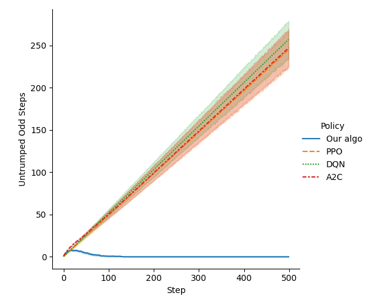

# POMDPs with Reveals
This is an implementation of algorithms for POMDPs which have the property of
revealing the state every so often.

## Simulating POMDPs
You can use `sim.py` to simulate a given POMDP. You will have to choose
actions to step through the environment and you will only get as feedback the
(support) of the beliefs. Internally, the simulator will use a pseudo-random
number generator to select a concrete successor state.

## Visualizing POMDPs
You can use `vis.py` to visualize a given POMDP. In addition, you can also
visualize the belief-support automaton on which the analysis of almost-sure
winning is realized. Check the help message of the script to determine what
arguments it requires.

## Checking almost-sure winning
The `aswin.py` utility can be used to compute the belief supports from which
it is possible to satisfy a {0,1,2}-parity objective with probability 1.

The utility can also produce a dot or png containing a depiction of a winning
strategy on the belief-support automaton. (For deployment of this policy, it
would need to be composed with a transducer that outputs the belief support
given the current sequence of observations.) The color code for the
transitions is as follows:
* Blue transitions are safe, i.e. if they are played uniformly at random then
  almost surely a good end component will eventually be reached. **NOTE: It is
  not true in general that any policy using blue transitions will almost
  surely reach a good end component.**
* Yellow transitions are internal to an end component whose maximal priority
  is 0, i.e. if played uniformly at random then the run will surely stay
  within the same end component and the maximal priority seen infinitely often
  will be 0.
* Green transitions are internal to an end component whose maximal priority is
  2, i.e. if played uniformly at random then the run will surely stay within
  the same end component and the maximal priority seen infinitely often will
  be 2.

## Comparing with learning policies
The `learn.py` utility can be used to train some deep reinforcement learning
policies that use an observation wrapper exposing the belief-support
automaton. Then, the performance of them is compared against that of an exact
solution.

The utility can be used, for instance, to compare the mean number of steps
between odd priorities and even ones that trump them (i.e. that are larger
than them) along a simulated run.

Above, one can see that an RL policy trained using PPO (from
[stable-baselines3](https://stable-baselines3.readthedocs.io/en/master/)) does
as well as flipping a coin in a revealing version of the classical
[tiger](https://www.pomdp.org/examples/) POMDP.
